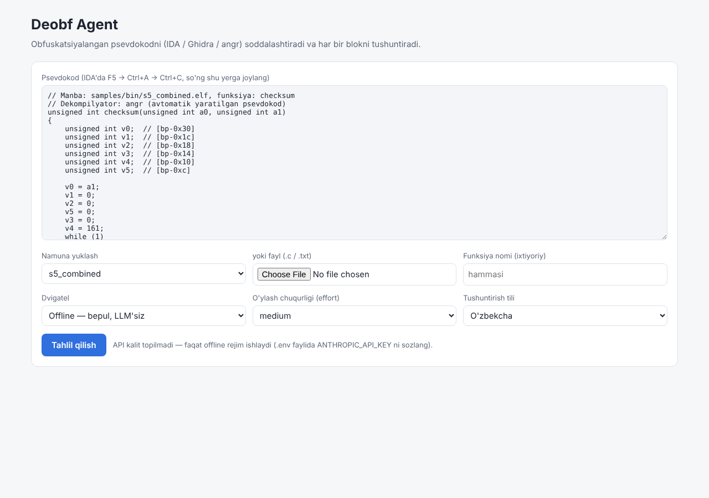
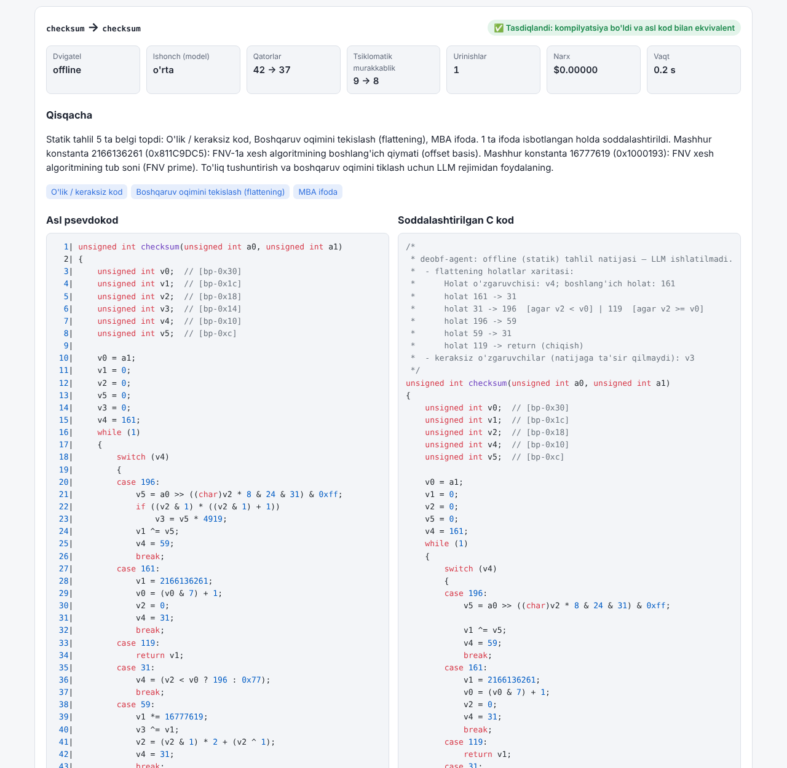

# Amaliy qism hisoboti

**Mavzu:** Obfuskatsiyalangan kodni deobfuskatsiya qilish agenti. IDA Pro yoki Ghidra orqali
olingan obfuskatsiyalangan kodni LLM yordamida soddalashtiradigan, C tilidagi ekvivalentini
yaratadigan va har bir blokni inson tushunadigan tilda tushuntiradigan vosita ishlab chiqish.

**Fan:** Reverse engineering (teskari muhandislik)  
**Bajardi:** ______________________  **Guruh:** __________  
**Qabul qildi:** ______________________  
**Repozitoriy:** `github.com/Uchqunbek12/for-claude-work` (branch `claude/vibrant-heisenberg-teie45`)

---

## Mundarija
1. Kirish
2. Talablar va texnologiyalarni tanlash
3. Tizim arxitekturasi
4. Amalga oshirish
5. Tajriba va natijalar
6. Cheklovlar va keyingi ishlar
7. Xulosa
8. Foydalanilgan adabiyotlar va vositalar
9. Ilovalar

---

## 1. Kirish

### 1.1. Mavzuning dolzarbligi
Zamonaviy dasturiy ta'minotni, ayniqsa zararli dasturlarni tahlil qilishda mutaxassislar ko'pincha
**obfuskatsiya** bilan to'qnash keladi. Obfuskatsiya dasturning xatti-harakatini saqlagan holda kodni
ataylab chalkashtiradi: oddiy ifodalar murakkab aralash arifmetik-mantiqiy (MBA) ifodalarga,
tuzilmali boshqaruv oqimi holatlar mashinasiga (control-flow flattening) aylantiriladi, satrlar
shifrlanadi, kodga soxta shartlar (opaque predicates) va o'lik kod qo'shiladi. IDA Pro va Ghidra kabi
dekompilyatorlar mashina kodini C ga o'xshash psevdokodga aylantiradi, lekin obfuskatsiyani to'liq
olib tashlay olmaydi. Natijada tahlilchi bitta funksiyani tushunishga soatlab vaqt sarflaydi.

Katta til modellari (LLM) kodni "o'qish" va tabiiy tilda tushuntirishda yuqori natija ko'rsatmoqda.
Biroq ular **xato qilishi** (gallyutsinatsiya) mumkin, xavfsizlik tahlilida esa noto'g'ri xulosa qimmatga
tushadi. Shuning uchun LLM imkoniyatlarini **formal tekshiruv** bilan birlashtiradigan vosita dolzarb hisoblanadi.

### 1.2. Maqsad
Obfuskatsiyalangan psevdokodni soddalashtiradigan, unga ekvivalent C kodni yaratadigan, har bir blokni
o'zbek tilida tushuntiradigan va natijaning to'g'riligini **avtomatik tekshiradigan** agent ishlab chiqish.

### 1.3. Vazifalar
1. IDA, Ghidra va angr psevdokodini qabul qiluvchi parser yaratish.
2. Asosiy obfuskatsiya usullarini LLM'siz aniqlovchi statik tahlil modulini yaratish.
3. Claude LLM bilan integratsiya: tuzilgan javob, narxni nazorat qilish, keshlash.
4. Natijani kompilyatsiya va differensial test bilan tekshirib, xato bo'lsa modeldan tuzatishni
   so'raydigan agent siklini yaratish.
5. CLI va Web interfeys, Markdown/HTML/JSON hisobotlar.
6. Toza va obfuskatsiyalangan versiyalari ma'lum bo'lgan test namunalarida vositani baholash.

### 1.4. Yangilik va amaliy ahamiyat
- LLM natijasi **ko'r-ko'rona qabul qilinmaydi**: gcc kompilyatsiyasi va asl psevdokod bilan
  differensial test orqali tekshiriladi, xato bo'lsa aniq qarshi misollar bilan modelga qaytariladi.
- Statik tahlil topilmalari **tasodifiy test bilan isbotlanadi** va LLM'ga "tasdiqlangan fakt"
  sifatida beriladi. Bu modelning ishini osonlashtiradi va narxni kamaytiradi.
- Flattening holatlar mashinasini graf tahlili orqali **LLM'siz** yechish algoritmi ishlab chiqildi.
- Talaba va kichik jamoalar uchun **arzon**: standart model Haiku 5.5 (~$0.001/funksiya), bepul offline rejim.

---

## 2. Talablar va texnologiyalarni tanlash

### 2.1. Funksional talablar
| № | Talab | Bajarilishi |
|---|---|---|
| T1 | IDA/Ghidra psevdokodini qabul qilish | ✅ parser, eksport skriptlari, nusxalash |
| T2 | Obfuskatsiyani soddalashtirish | ✅ statik + LLM |
| T3 | C tilidagi ekvivalentni yaratish | ✅ kompilyatsiya qilinadigan C kod |
| T4 | Har bir blokni inson tilida tushuntirish | ✅ bloklar bo'yicha o'zbekcha izoh (ru/en ham) |
| T5 | Natijaning to'g'riligini tekshirish | ✅ gcc + differensial test + o'z-o'zini tuzatish |
| T6 | Arzonlik | ✅ Haiku standart, kesh, offline rejim, narx hisoblagich |
| T7 | Qulay interfeys | ✅ CLI + Web UI |

### 2.2. Texnologiyalar
| Texnologiya | Tanlash sababi |
|---|---|
| Python 3.10+ | o'rganish oson, Claude'ning rasmiy SDK'si, matn bilan ishlash qulay |
| Anthropic Claude API (`anthropic` SDK) | structured outputs, prompt caching, model tanlash (Haiku/Sonnet/Opus) |
| pydantic | LLM javob sxemasini avtomatik tekshirish |
| gcc | natijani kompilyatsiya qilish va differensial test |
| Flask + Jinja2 | eng oddiy veb-freymvork; avtomatik HTML ekranlash (XSS himoyasi) |
| angr | bepul dekompilyator — namunalar uchun haqiqiy psevdokod olish |
| pytest, Playwright | avtomatik testlar va brauzerda UI tekshiruvi |

---

## 3. Tizim arxitekturasi

```
            ┌──────────────────────────────────────────────────────────────┐
 kirish ──► │ parser.py    uslub (IDA/Ghidra/angr/C), funksiyalar, global  │
 (matn)     │              ma'lumotlar, preambula                          │
            └───────────────┬──────────────────────────────────────────────┘
                            ▼
            ┌──────────────────────────────────────────────────────────────┐
            │ detectors.py + expr.py   MBA, opaque predicate, flattening,  │
            │   (bepul, isbotlangan)   satrlar, konstantalar, o'lik kod    │
            └───────────────┬──────────────────────────────────────────────┘
                 offline    │    LLM
          ┌─────────────────┴─────────────────┐
          ▼                                   ▼
 ┌──────────────────────┐        ┌───────────────────────────────┐
 │ offline.py           │        │ prompts.py → llm.py (Claude)  │
 │ unflatten.py         │        │ schema.py (structured output) │
 └─────────┬────────────┘        └──────────────┬────────────────┘
           │                                    │  ▲ xato matni / qarshi misollar
           ▼                                    ▼  │ (maks. 3 urinish)
            ┌──────────────────────────────────────────────────────────────┐
            │ verifier.py + harness.py + compiler.py                       │
            │   gcc sintaksis → nom/parametrlar → differensial test        │
            └───────────────┬──────────────────────────────────────────────┘
                            ▼
            ┌──────────────────────────────────────────────────────────────┐
            │ report.py → Markdown / HTML / JSON;  cli.py;  web/app.py     │
            └──────────────────────────────────────────────────────────────┘
```

Modullar (19 ta Python fayli, ~3400 qator kod; ~500 qator testlar):

| Modul | Vazifasi |
|---|---|
| `parser.py` | psevdokodni funksiyalarga ajratish (qavslarni sanash, izoh/satrlarni niqoblash), uslubni ball tizimi bilan aniqlash |
| `expr.py` | C butun sonli ifodalari uchun tokenizer, Pratt parser va C semantikasiga mos hisoblash |
| `detectors.py` | 7 ta detektor, holatlar mashinasini tiklash |
| `unflatten.py` | holatlar grafidan `while`/`if` tuzilmasini qurish |
| `offline.py` | isbotlangan o'zgarishlarni qo'llash, o'lik tarmoq/o'zgaruvchilarni olib tashlash |
| `prompts.py`, `schema.py`, `llm.py` | Claude bilan ishlash |
| `compiler.py`, `harness.py`, `verifier.py` | tekshiruv |
| `agent.py` | jarayonni boshqarish, urinishlar, zaxira yo'llar |
| `report.py`, `cli.py`, `web/` | interfeys va hisobotlar |
| `evaluate.py`, `metrics.py` | baholash |

---

## 4. Amalga oshirish

### 4.1. Parser
Dekompilyator psevdokodi standart C emas (`__fastcall`, `int a1@<eax>`, `LODWORD(v) = 5`), shuning uchun
to'liq C parserlari unda xato beradi. Ishlab chiqilgan parser izohlar va satr literallarini niqoblaydi,
yuqori darajadagi `{...}` bloklarni topadi va oldidagi matnni funksiya signaturasi sifatida tahlil qiladi.
Uslub ball tizimi bilan aniqlanadi (IDA: `sub_`, `_DWORD`, `// [rsp+..]`; Ghidra: `FUN_`, `undefined4`,
`param_1`; angr: `// [bp-0x..]`). `re_types.h` sarlavha fayli IDA/Ghidra turlarini standart C turlariga
bog'laydi, shuning uchun psevdokodning o'zini ham kompilyatsiya qilish mumkin bo'ladi.

### 4.2. Ifoda kalkulyatori va tasodifiy test
`expr.py` C ifodalarini 32/64 bitli arifmetika, ishorali/ishorasiz taqqoslash va tur o'zgartirishlarni
hisobga olib hisoblaydi. Uning asosida ikki amal qurilgan:
- `is_constant(e)` — 3000 tasodifiy kirishda qiymat o'zgarmasa, ifoda konstanta (opaque predicate);
- `equivalent(a, b)` — ikki ifoda barcha sinovlarda teng (MBA soddalashtirish).

Kirish qiymatlari aralash tanlanadi: chegaraviy qiymatlar (0, 1, 0x7FFFFFFF, 0x80000000, 0xFFFFFFFF, ...),
kichik sonlar va ixtiyoriy 32 bitli sonlar.

### 4.3. Detektorlar
| Detektor | Algoritm |
|---|---|
| MBA | arifmetik va bit amallari aralash ifodalar uchun nomzodlar to'plamini (`x`, `~x`, `x±y`, `x^y`, `x+k`, ...) sinab, tasodifiy testda teng chiqqanini tanlash (sintez orqali soddalashtirish) |
| Yashirin konstantalar | o'zgaruvchisiz ifodani hisoblab, bitta songa yig'ish |
| Opaque predicate | `if`/`while`/ternar shartlarni va ularning qismlarini `is_constant` bilan tekshirish |
| O'lik kod | aniqlanish-ishlatilish (def-use) tahlili: qiymat beriladi, lekin hech qayerda o'qilmaydi |
| Flattening | `while(1){switch(v)}` va `v == CONST` zanjirlarini topish, o'tishlar jadvalini tiklash |
| Kodlangan satrlar | global/stekdagi baytlarni koddagi XOR kalitlari bilan, topilmasa barcha 255 kalit bilan ochish; matn "tabiiyligi" bo'yicha baholash |
| Mashhur konstantalar | FNV, CRC32, TEA, MD5, SHA, MurmurHash va boshqalar jadvali |

### 4.4. Flattening'ni yechish
Holatlar grafi qurilib, boshlang'ich holatdan rekursiv yuriladi: bitta chiqishli tugunlar chiziqli
ketma-ketlikka, o'z tuguniga qaytuvchi shartli tarmoqlar `while` tsikliga, qolgan shartli tugunlar
`if/else` ga (qo'shilish nuqtasi BFS bilan topiladi) aylantiriladi. Murakkab holatlarda algoritm
o'zgartirish kiritmaydi va ish LLM'ga qoldiriladi.

### 4.5. LLM integratsiyasi
- **Model:** standart `claude-haiku-5-5` ($0.10 / $0.50 har 1M token), `--model sonnet|opus` bilan almashtiriladi.
- **Structured outputs:** javob `DeobfResult` sxemasida keladi (C kod, bloklar, qayta nomlashlar, xulosa, ishonch).
- **Prompt:** o'zgarmas tizim ko'rsatmasi (prompt keshlanadi) + raqamlangan psevdokod + global ma'lumotlar
  + **isbotlangan statik faktlar** + holatlar xaritasi + tushuntirish tili.
- **Narx nazorati:** token hisoblagich, disk kesh (takroriy so'rov $0), avtomatik prompt keshi,
  sozlanadigan `effort`.
- **Xatolar:** noto'g'ri kalit, limit, tarmoq, rad etish, javob kesilishi — o'zbekcha xabar va offline zaxira.

### 4.6. Tekshiruv va agent sikli
1. `gcc -fsyntax-only` — sintaksis; 2. funksiya nomi va parametrlar soni; 3. differensial test:
asl psevdokod (`-D` makrosi bilan qayta nomlangan) va yangi kod bitta dasturga bog'lanadi va 2000 tasodifiy
kirishda solishtiriladi. Global ma'lumotlar (`extern char ENC`) binar fayldan olingan baytlar bilan alohida
fayl sifatida bog'lanadi. Xato bo'lsa, gcc xabarlari yoki **qarshi misollar** (`args=(...) original=... candidate=...`)
modelga qaytariladi. Urinishlarning eng yaxshisi saqlanadi, muvaffaqiyatsizlik esa ochiq ko'rsatiladi.

### 4.7. Interfeyslar
- **CLI:** `deobf analyze | functions | web | eval` (argparse).
- **Web UI:** namuna yuklash, dvigatel tanlash, natijalar yonma-yon, bloklar, qayta nomlashlar,
  tekshiruv tarixi, yuklab olish (MD/HTML/JSON). Server faqat `127.0.0.1` da ishlaydi.





---

## 5. Tajriba va natijalar

### 5.1. Test namunalari
Baholash uchun "to'g'ri javob" ma'lum bo'lishi kerak, shuning uchun 5 ta namuna ikki versiyada yozildi:
toza (asl) va obfuskatsiyalangan. Ularning ekvivalentligi 20 000 test bilan tasdiqlandi.
Obfuskatsiyalangan versiya `gcc -O0` bilan kompilyatsiya qilinib, **angr** dekompilyatori bilan psevdokodga aylantirildi.

| Namuna | Funksiya | Obfuskatsiya |
|---|---|---|
| s1_mba | `mix(a, b)` | MBA |
| s2_opaque | `clamp(x, lo, hi)` | opaque predicate + o'lik kod |
| s3_flatten | `gcd(a, b)` | control-flow flattening |
| s4_strings | `greet_char(idx)` | XOR bilan kodlangan satr |
| s5_combined | `checksum(x, n)` (FNV-1a) | flattening + MBA + opaque + o'lik kod + kodlangan konstantalar |

### 5.2. Metodika
- **Psevdokodga ekvivalentlik** — agentning o'z tekshiruvi (2000 test).
- **Asl kodga ekvivalentlik** — natija toza manba bilan 5000 testda solishtiriladi (agent toza kodni ko'rmaydi).
- **Recall** — psevdokodda bor usullarning topilgan ulushi.
- **Murakkablik** — qatorlar soni va McCabe tsiklomatik murakkabligi (CC).

### 5.3. Natijalar: offline rejim (LLM'siz, $0)
| Namuna | Psevdokodga ekv. | Asl kodga ekv. | Usullar | Qatorlar (psevdo → natija → toza) | CC (psevdo → natija → toza) |
|---|---|---|---|---|---|
| s1_mba | ✅ | ✅ | 100% | 10 → 10 → 4 | 1 → 1 → 1 |
| s2_opaque | ✅ | ❌* | 100% | 17 → 10 → 6 | 7 → 5 → 3 |
| s3_flatten | ✅ | ✅ | 100% | 28 → 12 → 6 | 7 → 2 → 2 |
| s4_strings | ✅ | ✅ | 100% | 9 → 10 → 4 | 2 → 2 → 1 |
| s5_combined | ✅ | ✅ | 100% | 42 → 18 → 8 | 9 → 2 → 2 |
| **Jami** | **5/5** | **4/5** | **100%** | **106 → 60 (−43%)** | **26 → 12 (−54%)** |

\* angr dekompilyatorining xatosi (5.5-bo'lim).

### 5.4. Natijalar: LLM rejimi
Ishlab chiqish muhitida Claude API kaliti bo'lmagani sababli LLM rejimi **mazkur hisobot yozilgan vaqtda
o'lchanmagan**. Agent siklining mantiqi (xatoni aniqlash → qarshi misollar bilan qayta so'rash → tuzatish)
soxta mijoz yordamida avtomatik testlar bilan tekshirilgan. Haqiqiy o'lchash buyrug'i:
`deobf eval --model haiku -o docs/baholash_haiku.md` (5 namuna uchun taxminiy narx ≈ $0.01).
Natijalar olingach, shu bo'limga qo'shiladi.

### 5.5. Muhim kuzatuvlar
1. **Dekompilyator ham xato qiladi.** angr `(u*u + u) % 2 == 0` sharti (har doim rost)ni
   `!((v1 & 1) * ((v1 & 1) + 1))` ga "soddalashtirib", `% 2` ni tushirib qoldirgan. Natijada toq sonlarda
   shart noto'g'ri bo'lib qolgan. Differensial test buni aniqladi. Xulosa: psevdokodga ham to'liq
   ishonib bo'lmaydi.
2. **Tekshiruv ishlab chiquvchining o'z xatolarini ham ushlaydi.** Obfuskatsiyalangan `s2` namunasini yozishda
   yo'l qo'yilgan mantiqiy xato (3353/20000 testda farq), shuningdek unflatten va o'lik kodni olib tashlashdagi
   xatolar avtomatik aniqlandi. Ularning hech biri foydalanuvchiga "tasdiqlangan" deb ko'rsatilmadi.
3. **Dekompilyator obfuskatsiyaning bir qismini o'zi yechadi** (masalan, `(s|d)-(s&d)` → `s^d`, kodlangan
   konstantalar), lekin flattening, opaque predicate va o'lik kod qoladi. Aynan shu qismni agent yechadi.
4. **Statik usullarning chegarasi:** LLM'siz murakkablikni 54% kamaytirish mumkin, lekin mazmunli nomlar
   berish va kodni tabiiy tilda tushuntirish uchun LLM kerak.

### 5.6. Avtomatik testlar
40 ta test (pytest): parser (5), differensial test (4), detektorlar (8), Claude moduli (5), agent sikli (6),
Web UI va hisobot (5), unflatten (7). Natija: **40/40 o'tdi**.

---

## 6. Cheklovlar va keyingi ishlar
| Cheklov | Mumkin bo'lgan yechim |
|---|---|
| Differensial test faqat butun sonli parametrli funksiyalar uchun | ko'rsatkichli funksiyalar uchun xotira modelini yaratish yoki simvolik bajarish (angr) |
| Tasodifiy test — isbot emas | SMT-yechuvchi (Z3) bilan formal ekvivalentlik isboti |
| Unflatten faqat oddiy holatlar mashinasi uchun | dominatorlar daraxtiga asoslangan to'liq tuzilma tiklash algoritmi |
| Virtualizatsiya (VMProtect) qo'llab-quvvatlanmaydi | loyiha doirasidan tashqarida |
| LLM rejimi hali o'lchanmagan | API kalit bilan `deobf eval` |
| IDA/Ghidra eksport skriptlari sinab ko'rilmagan | IDA/Ghidra o'rnatilgan kompyuterda sinash |
| Psevdokod funksiyalararo tahlil qilinmaydi | chaqiruv grafi bo'yicha ketma-ket tahlil |

---

## 7. Xulosa
Ishlab chiqilgan **deobf-agent** vositasi IDA, Ghidra va angr psevdokodini qabul qiladi, beshta asosiy
obfuskatsiya usulini (MBA, opaque predicate, control-flow flattening, kodlangan satr/konstantalar, o'lik kod)
aniqlaydi, Claude LLM yordamida toza C kod va bloklar bo'yicha o'zbekcha tushuntirish yaratadi. Har bir natija
kompilyatsiya va differensial test bilan tekshiriladi, xato topilsa model aniq qarshi misollar bilan tuzatishga
yo'naltiriladi. Shu tufayli vosita oddiy chatbot emas, balki **o'z natijasini tekshiradigan agent** hisoblanadi.

Test namunalarida LLM'siz offline rejim ham barcha usullarni aniqladi (100%), 5/5 natijaning psevdokodga
ekvivalentligini isbotladi va tsiklomatik murakkablikni 54% ga kamaytirdi. Ish davomida dekompilyatorning
o'zi ham xato qilishi mumkinligi aniqlandi va tekshiruv bunday holatlarni ochib berdi. Vosita talabalar uchun
arzon: standart Haiku modeli bilan bitta funksiya tahlili taxminan $0.001 turadi, takroriy tahlil esa bepul.

---

## 8. Foydalanilgan adabiyotlar va vositalar
1. C. Collberg, C. Thomborson, D. Low. *A Taxonomy of Obfuscating Transformations.* Technical Report 148,
   University of Auckland, 1997.
2. C. Wang. *A Security Architecture for Survivability Mechanisms.* PhD thesis, University of Virginia, 2001
   (control-flow flattening).
3. T. László, Á. Kiss. *Obfuscating C++ Programs via Control Flow Flattening.* Annales Univ. Sci. Budapest.,
   Sect. Comp., 2009.
4. Y. Zhou, A. Main, Y. X. Gu, H. Johnson. *Information Hiding in Software with Mixed Boolean-Arithmetic
   Transforms.* WISA 2007, LNCS 4867.
5. P. Junod, J. Rinaldini, J. Wehrli, J. Michielin. *Obfuscator-LLVM — Software Protection for the Masses.*
   SPRO 2015.
6. Y. Shoshitaishvili va boshq. *SoK: (State of) The Art of War: Offensive Techniques in Binary Analysis.*
   IEEE S&P 2016 (angr).
7. T. J. McCabe. *A Complexity Measure.* IEEE Transactions on Software Engineering, SE-2(4), 1976.
8. Hex-Rays. *IDA Free / IDA Pro.* <https://hex-rays.com/>
9. National Security Agency. *Ghidra.* <https://ghidra-sre.org/>
10. Anthropic. *Claude API documentation.* <https://docs.anthropic.com/>
11. Python, Flask, pydantic, pytest, Playwright, GCC — rasmiy hujjatlar.

---

## 9. Ilovalar
- **A.** Ish jurnali (har bir qadam va uning sababi): [01_jurnal.md](01_jurnal.md)
- **B.** Foydalanish yo'riqnomasi: [02_foydalanish.md](02_foydalanish.md)
- **C.** Baholash jadvali: [baholash_offline.md](baholash_offline.md) va `baholash_offline.json`
- **D.** Manba kodi: `deobf_agent/`, testlar: `tests/`, namunalar: `samples/`
